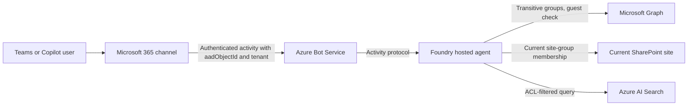

# Phase 7 Plan: Test-Tenant Identity for Teams and Copilot

## Objective

Replace the evaluation identity fallback with validated per-user identity for both Microsoft Teams and Microsoft 365 Copilot in the existing test tenant. Continue using the current Foundry agent, SharePoint site, and Azure AI Search resources. Do not create production resources in this phase.

## Fixed Decisions

| Area | Decision |
| --- | --- |
| Channels | Microsoft Teams and Microsoft 365 Copilot |
| Channel integration | Activity protocol on the hosted agent; Azure Bot bound to the agent instance identity |
| Caller identity | Entra object ID (`aadObjectId`) and tenant supplied by Teams on the authenticated Bot Service channel |
| Tenant | Existing test tenant only |
| Guests | Rejected |
| Cross-tenant callers | Rejected |
| SharePoint scope | Current configured site only |
| Preferred authorization | Entra groups |
| SharePoint-only groups | Resolve live on every request |
| Mapping/cache | Azure Cache for Redis only if a later need appears; not required for identity correlation |
| Production resources | Deferred |
| Development fallback | Never used on the Teams/Copilot path |

## Status

| Step | State |
| --- | --- |
| Activity protocol added; agent serves Responses and Activity from one host | Done (agent version 15) |
| Azure Bot and Teams channel created by `azd deploy` | Done |
| Teams app package (`azd ai agent pack`) sideloaded and answered with a citation | Done |
| Teams-supplied identity reaches the handler and drives the ACL filter | Verified |
| Graph `GroupMember.Read.All` and `User.ReadBasic.All` (application) granted to the agent identity | Done |
| Entra group `SharePoint Agent Test Readers` created and given read access to the test documents; index resynced | Done |
| Live Entra group resolution and guest/disabled-account rejection on the Teams path | Deployed (agent version 16); Teams verification pending |
| SharePoint site-group resolution | Deferred; Entra groups are the access model |
| Microsoft 365 Copilot test | Pending |

## Target Flow



The user's Entra object ID comes from Teams over the authenticated Bot Service channel, so no user token or on-behalf-of exchange is needed for authorization. The agent looks up groups with its own identity.

## Human Preparation

### 1. Entra app registration (not needed on the current path)

The app registration `FoundrySharePointAgent-Channel-Test` was created for the original SSO design. With the Activity protocol, the Azure Bot uses the agent's own instance identity, so steps 7–9 (Application ID URI, `access_as_user` scope, authorized client applications, client secret) are not required. Keep the registration unused for now; delete it later if the SSO path is not revived.

<details>
<summary>Original SSO steps (kept for reference)</summary>

Create one single-tenant app registration for the test channel integration:

1. Open **Microsoft Entra ID > App registrations > New registration**.
2. Name it `FoundrySharePointAgent-Channel-Test` or another clearly test-scoped name.
3. Select **Accounts in this organizational directory only**.
4. Leave the redirect URI empty initially. Add the exact redirect URI generated by the Teams/Copilot channel scaffold later; do not invent one.
5. Create the registration.
6. Record these non-secret values for implementation:
   - Application (client) ID. 
   - Directory (tenant) ID. 
   - Object ID of the app registration. 
7. Under **Expose an API**, accept or set the Application ID URI after the channel scaffold provides the expected value, then add a delegated scope named `access_as_user`.
8. Add authorized client applications only from the generated Teams/Copilot configuration. The AI implementation must provide the exact client IDs and scope before this step.
9. Do not create a client secret unless the selected channel hosting model requires one and managed identity or federation cannot be used. If a secret becomes unavoidable, store it in Key Vault and never in Git or chat.

</details>

### 2. Approve Graph permissions

Grant the **agent instance identity** (`AGENT_SHAREPOINT_RAG_AGENT_INSTANCE_IDENTITY_PRINCIPAL_ID` in the azd environment) this application permission, then grant admin consent:

| Permission | Type | Purpose |
| --- | --- | --- |
| `GroupMember.Read.All` | Application | Resolve the caller's transitive Entra group membership |
| `User.ReadBasic.All` | Application | Check `userType` to reject guests |

SharePoint site-group membership may need one more permission; the implementation must prove the minimum before requesting it.

<details>
<summary>Original delegated permissions for the SSO design</summary>

Start with this least-privilege candidate set and finalize it against the implemented API calls:

| Permission | Type | Purpose |
| --- | --- | --- |
| `User.Read` | Delegated | Read the signed-in user's basic identity |
| `GroupMember.Read.All` | Delegated | Resolve transitive Entra group membership |

SharePoint membership may require an additional delegated SharePoint or Graph permission. Do not grant tenant-wide site access speculatively. The AI implementation must first prove the exact endpoint and minimum permission required for membership checks on the current site, then present it for admin consent.

Admin consent is available in this test tenant. Record all granted permissions in this document during implementation.

</details>

### 3. Prepare channel administration

Confirm that the administrator can:

- Sideload or publish a test Teams app to a limited audience.
- Make the same agent available in Microsoft 365 Copilot for that audience.
- Approve the app's SSO configuration and delegated permissions.
- Remove or disable the test app if validation fails.

### 4. Prepare test users and groups

Use Entra groups as the default authorization model. When implementation reaches validation, create or identify:

| Identity | Access setup | Expected result |
| --- | --- | --- |
| User A | Member of an allowed Entra group | Can retrieve the allowed test document |
| User B | Not a member of any allowed group | Cannot retrieve the document |
| User C | Directly granted access | Can retrieve the directly allowed document |
| User D | Member of an allowed SharePoint-only group | Can retrieve through live site-group resolution |

AI can guide this setup when the test documents and existing groups are known. Do not create all four users immediately if suitable existing test accounts are available. At minimum, testing needs two independently authenticated users with different access.

## AI Implementation Work

### Stage 1: Channel scaffold and identity contract

1. Scaffold or configure one Microsoft 365 application for Teams and Copilot.
2. Generate the channel manifest and exact redirect URI, Application ID URI, authorized client applications, and SSO scope.
3. Document the channel-provided identity headers and tokens.
4. Prove how the channel caller is correlated to Entra `tid` and `oid` without trusting arbitrary client input.
5. Use on-behalf-of exchange only if required by the selected SDK and Graph calls.

**Gate:** A test user can sign in, and the backend logs a redacted identity event containing only tenant ID, object ID, channel, and correlation ID.

### Stage 2: Token validation

Implement validation for:

- Signature and current signing key.
- Issuer.
- Audience.
- Expiration and not-before.
- Tenant equals the configured test tenant.
- User `oid` is present.
- Authorized client application where applicable.
- Guest and cross-tenant rejection.

Never log access tokens, refresh tokens, authorization headers, or complete claims payloads.

**Gate:** Invalid audience, expired token, missing `oid`, guest, and foreign-tenant tests all fail closed.

### Stage 3: Principal resolution

For every request:

1. Add the validated user object ID.
2. Resolve all transitive Entra group IDs through Microsoft Graph with pagination.
3. Resolve membership in relevant SharePoint-only groups for the current site.
4. Add only principal formats supported by the Search index.
5. Validate principal characters and enforce a maximum count and payload size.
6. Return no principals if any required identity step is ambiguous or untrusted.

Do not add `tenant:<tenant-id>` by default. Do not cache SharePoint-only membership decisions.

### Stage 4: Azure Cache for Redis

Provision one test-scoped Azure Cache for Redis instance only after cost approval. Use Microsoft Entra authentication and managed identity where supported.

Allowed Redis uses:

- Short-lived correlation from an opaque channel/Foundry user key to validated tenant and object IDs.
- Replay protection, nonce state, or temporary OBO coordination if required.
- Non-authoritative operational data with a maximum TTL of five minutes.

Prohibited Redis uses:

- Permanent identity mappings.
- Cached SharePoint-only membership used for authorization.
- Access or refresh tokens in plaintext.
- Client-provided principal arrays.

**Gate:** Deleting a correlation entry causes safe re-resolution or a fail-closed response, never broader access.

### Stage 5: Agent integration

Replace the channel path through `FOUNDRY_USER_PRINCIPAL_MAP_JSON` with the trusted resolver. Keep static mapping only for explicit local tests.

For channel validation set:

```env
ALLOW_LOCAL_DEVELOPMENT_IDENTITY=false
LOCAL_DEVELOPMENT_PRINCIPAL_IDS=
FOUNDRY_USER_PRINCIPAL_MAP_JSON={}
```

The Search filter must still be applied before document text reaches the model. Retrieval must continue using only the latest user turn.

### Stage 6: Teams and Copilot validation

Run the same identity matrix in both channels:

1. User A receives a grounded answer and valid SharePoint citation.
2. User B receives the no-authorized-results response.
3. User C validates direct-user ACL behavior.
4. User D validates live SharePoint-only group resolution.
5. Remove User A from the Entra group and verify access is revoked on the next request or after Graph propagation.
6. Confirm one user's conversation cannot expose another user's retrieved context.
7. Confirm changing topics in one conversation retrieves context only for the latest question.

## Simple Test-Tenant Security Policy

- Single configured tenant only.
- Member users only; guests are denied.
- No cross-tenant identities.
- Only the currently configured SharePoint site.
- Entra groups are preferred for new access assignments.
- SharePoint-only memberships are resolved live per request.
- No organization-wide tenant principal unless separately approved.
- Five-minute maximum TTL for non-authoritative Redis data.
- Fail closed on token, Graph, SharePoint, Redis-correlation, or resolver errors.
- No tokens, document text, secrets, or full ACL lists in logs.
- Retain security audit events for 30 days in the test environment.
- Limit Teams/Copilot availability to named test users until all gates pass.

## Deferred Until Production

- Separate production tenant or subscription resources.
- Production Foundry, Search, Redis, and ingestion resources.
- Production certificate or workload identity lifecycle.
- High availability, private networking, disaster recovery, and formal SLOs.
- Guest or cross-tenant support.
- Broad Teams/Copilot publication.
- Long-term identity or authorization caching.

## Completion Checklist

### Human

- [ ] Single-tenant app registration created.
- [ ] Client ID, tenant ID, and app object ID recorded locally.
- [ ] Generated redirect URI and Application ID URI configured.
- [ ] `access_as_user` scope configured.
- [ ] Exact generated authorized clients configured.
- [ ] Least-privilege delegated Graph permissions approved.
- [ ] Two or more independently authenticated test users available.
- [ ] Entra test group and test document ACL prepared.
- [ ] Limited Teams/Copilot test audience approved.

### AI

- [ ] Teams and Copilot channel scaffold generated.
- [ ] Token validation implemented and tested.
- [ ] OBO flow implemented if required.
- [ ] Transitive Entra group resolution implemented.
- [ ] Current-site SharePoint group resolution implemented per request.
- [ ] Test Redis configured for correlation-only use.
- [ ] Static/development fallback disabled for channel tests.
- [ ] Agent resolver integration implemented fail-closed.
- [ ] Teams identity matrix passes.
- [ ] Copilot identity matrix passes.
- [ ] Revocation and cross-user isolation tests pass.