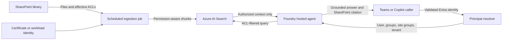

# Plan: SharePoint Ingestion and Identity Mapping

## Purpose

This document is the repeatable setup and operations plan for:

1. Reading documents and effective permissions from SharePoint.
2. Indexing permission-aware chunks in Azure AI Search.
3. Mapping an agent caller to trusted SharePoint principals.
4. Applying authorization filters before content reaches the model.
5. Validating both authorized access and fail-closed denial.

Each step identifies who can perform it:

- **AI agent**: safe to automate with the available tools and authenticated environment.
- **Human admin**: requires approval, interactive authentication, ownership decisions, or handling secrets.
- **Either**: may be automated after a human approves the scope and cost.

## Current Verified State

| Item | Value | Status |
| --- | --- | --- |
| Tenant domain | `<your-tenant>.onmicrosoft.com` | Configure per environment |
| Tenant ID | `<your-tenant-id>` | Configure per environment |
| Subscription ID | `<your-subscription-id>` | Configure per environment |
| Foundry project | `<your-project>` | Configure per environment |
| Foundry region | `francecentral` | Configured |
| Model deployment | `gpt-4.1-mini` | Available; upgrade before production recommended |
| SharePoint source | Root site `/Shared Documents` | Configured |
| Search service | `<your-search>` | Configure per environment |
| Search local/API-key auth | Disabled | Verified |
| Search index | `sharepoint-documents` | Created |
| Ingestion app | `FoundrySharePointAgent-Ingestion` | Created |
| Ingestion client ID | `<ingestion-app-client-id>` | Configure per environment |
| Graph application role | `Sites.Selected` only | Verified |
| Selected-site role | `fullcontrol` on the root site only | Verified |
| Initial synchronization | 1,354 chunks from 3 files; 0 skipped | Completed |
| Local certificate expiry | September 24, 2027 | Rotation required before expiry |
| Unit tests | 15 passing | Verified |
| Hosted agent deployment | `sharepoint-rag-agent` version 13 | Evaluation deployment verified |
| Hosted agent Search RBAC | `Search Index Data Reader` on the hosted identity | Verified |
| Playground retrieval | Authorized citations and multi-turn isolation | Verified |
| Development identity fallback | Enabled in the evaluation environment only | Must be disabled before production |
| Production caller identity resolver | Not implemented | Blocking production publication |

## Target Architecture



## Security Invariants

These requirements must remain true throughout setup and operation:

1. Search API keys remain disabled.
2. The ingestion app keeps only the tenant-wide Graph role `Sites.Selected`.
3. The ingestion app receives access only to approved SharePoint sites.
4. Certificate private keys, client secrets, and tokens are never committed.
5. Caller principal IDs are produced server-side from validated identity, never trusted from arbitrary client input.
6. Search always applies an `allowedPrincipals` filter before returning content.
7. Missing identity mappings and zero authorized results fail closed.
8. Anonymous SharePoint links are not converted into searchable authorization grants.
9. Authorized and unauthorized tests use new sessions and new conversations.
10. Production must not enable `ALLOW_LOCAL_DEVELOPMENT_IDENTITY`.
11. Development mappings and test principals must not be copied into production.
12. Each retrieval query must use the current user turn; prior retrieved context must not affect a later authorization decision.

## Phase 1: Confirm Scope and Ownership

### 1.1 Confirm the SharePoint source

**Owner:** Human admin

Confirm that this remains the intended synchronization root:

```text
https://<your-tenant>.sharepoint.com/Shared Documents
```

The configured browser URL is stored as `SHAREPOINT_FOLDER_URL`. A nested folder can be selected later by changing the `id` query parameter to include the folder path.

**Acceptance gate:**

- The site owner approves indexing the library.
- The data owner approves sending document text to Azure AI Search and the selected Foundry model.
- The expected document sensitivity and retention rules are documented.

### 1.2 Select environments

**Owner:** Human admin

Decide whether development, test, and production use separate:

- Foundry projects and model deployments.
- Azure AI Search services and indexes.
- Entra ingestion applications.
- SharePoint source libraries or sites.
- Certificates or workload identities.

**Recommendation:** Separate production resources and identities from development resources.

## Phase 2: Prerequisites and Authentication

### 2.1 Verify local tooling

**Owner:** AI agent or human developer

```bash
az version
azd version
uv --version
python --version
```

Expected Python version: 3.13 or later.

### 2.2 Authenticate to the intended tenant

**Owner:** Human developer

Interactive authentication must be performed by the human when required:

```bash
az login --tenant <your-tenant-id>
azd auth login --tenant-id <your-tenant-id>
```

Verify:

```bash
az account show --query '{tenantId:tenantId,subscriptionId:id,user:user.name}' -o json
azd auth login --check-status
```

**Acceptance gate:** Both tools use the intended tenant and subscription.

### 2.3 Synchronize Python dependencies

**Owner:** AI agent or human developer

```bash
cd src/agent-framework-agent-azure-search-rag-responses
uv sync --frozen --python 3.13
uv run --no-sync pytest -q
```

**Acceptance gate:** All tests pass.

## Phase 3: Provision Azure AI Search

### 3.1 Review cost and deployment preview

**Owner:** Human approves; AI agent or human executes

Search Basic is billable. Review the Bicep template:

```bash
az bicep build --file infra/search.bicep --stdout >/dev/null
az deployment group what-if \
  --resource-group <your-resource-group> \
  --template-file infra/search.bicep \
  --parameters location=francecentral \
  --result-format ResourceIdOnly
```

**Acceptance gate:** The preview contains only the intended Search service and approved supporting changes.

### 3.2 Deploy Search

**Owner:** AI agent or human, after cost approval

```bash
./scripts/provision-search.sh
```

Current development endpoint:

```text
https://<your-search>.search.windows.net
```

### 3.3 Assign Search RBAC

**Owner:** AI agent or Azure administrator

| Principal | Role | Purpose |
| --- | --- | --- |
| Setup/operator identity | `Search Service Contributor` | Create and inspect indexes |
| Setup/operator identity | `Search Index Data Contributor` | Initial data operations |
| Ingestion app/job identity | `Search Index Data Contributor` | Upsert and delete chunks |
| Hosted agent managed identity | `Search Index Data Reader` | Query authorized chunks |

Do not assign Search write roles to the hosted answering agent.

Verify:

```bash
SEARCH_ID=$(az search service show \
  --name <your-search> \
  --resource-group <your-resource-group> \
  --query id -o tsv)

az role assignment list \
  --scope "$SEARCH_ID" \
  --include-inherited \
  --query '[].{principal:principalName,role:roleDefinitionName}' \
  -o table
```

### 3.4 Create or validate the index

**Owner:** AI agent or operator

```bash
cd src/agent-framework-agent-azure-search-rag-responses
AZURE_AUTH_MODE=cli uv run --no-sync python provision_index.py
```

The required schema is:

| Field | Type | Security/use |
| --- | --- | --- |
| `id` | `Edm.String` | Unique chunk key |
| `content` | `Edm.String` | Searchable extracted text |
| `sourceName` | `Edm.String` | Citation title |
| `sourceLink` | `Edm.String` | SharePoint citation URL |
| `sourceItemId` | `Edm.String` | Graph drive item ID |
| `sourceETag` | `Edm.String` | Source version |
| `sourceRoot` | `Edm.String` | Synchronization boundary |
| `chunkIndex` | `Edm.Int32` | Chunk ordering |
| `allowedPrincipals` | `Collection(Edm.String)` | Filterable ACL principals |

**Acceptance gate:** The script creates the index or reports that the existing schema is compatible.

## Phase 4: Configure the SharePoint Ingestion Identity

### 4.1 Create a dedicated Entra application

**Owner:** Entra administrator or AI agent with explicit approval

Create a single-tenant daemon application with no redirect URI. Production should use one of:

1. Workload identity federation or managed identity where supported.
2. A certificate stored in Key Vault.
3. A local certificate only for development.

Never use a client secret in committed configuration.

### 4.2 Add only `Sites.Selected`

**Owner:** Entra administrator

Add the Microsoft Graph **application** permission:

```text
Sites.Selected
```

Grant tenant admin consent.

**Acceptance gate:** Decode a test app-only token and verify its `roles` claim is exactly:

```json
["Sites.Selected"]
```

It must not contain `Sites.Read.All`, `Sites.ReadWrite.All`, or `Sites.FullControl.All`.

### 4.3 Grant access to the selected site

**Owner:** SharePoint/Global administrator

`Sites.Selected` grants no access until a site permission is created. The permanent ingestion app currently has `fullcontrol` on only the root site.

Why `fullcontrol` is used at the selected-site layer:

- The synchronizer reads content only.
- Complete effective permission enumeration may not be returned to a read-only caller.
- Full ACL visibility is required to construct correct security filters.
- Tenant-wide permission remains `Sites.Selected`, limiting access to explicitly granted sites.

A site grant requires a caller with `Sites.FullControl.All`. Use a tightly controlled admin process or a temporary bootstrap identity. If a temporary identity is used:

1. Create it for the grant operation only.
2. Give it `Sites.FullControl.All`.
3. Create the selected-site permission.
4. Delete its application, service principal, and credentials immediately.
5. Verify no temporary bootstrap identities remain.

**Acceptance gate:** Query `/sites/{site-id}/permissions` with the permanent ingestion app and verify its site entry has the intended role.

### 4.4 Configure certificate variables

**Owner:** Human secret/certificate administrator

Development `.env` values:

```env
AZURE_TENANT_ID=<your-tenant-id>
AZURE_CLIENT_ID=<ingestion-app-client-id>
AZURE_CLIENT_CERTIFICATE_PATH=/secure/path/sharepoint-ingestion.pfx
```

Production requirements:

- Store the certificate in Key Vault or use workload identity federation.
- Restrict filesystem and Key Vault access to the ingestion job.
- Alert 60 and 30 days before expiry.
- Rotate without downtime by overlapping old and new credentials briefly.
- Remove the old credential after successful validation.

## Phase 5: Configure and Run Ingestion

### 5.1 Configure source and limits

**Owner:** AI agent or operator

```env
SHAREPOINT_FOLDER_URL=https://<your-tenant>.sharepoint.com/Shared%20Documents
AZURE_SEARCH_ENDPOINT=https://<your-search>.search.windows.net
AZURE_SEARCH_INDEX_NAME=sharepoint-documents
SHAREPOINT_MAX_FILE_BYTES=52428800
LOG_LEVEL=WARNING
```

Supported formats:

- `.docx`
- `.pptx`
- `.xlsx`
- `.pdf`
- `.html`
- `.txt`
- `.md`
- `.csv`
- `.json`
- `.xml`

### 5.2 Run synchronization

**Owner:** AI agent or operator

```bash
cd src/agent-framework-agent-azure-search-rag-responses
LOG_LEVEL=WARNING uv run --no-sync python sync_sharepoint.py
```

The synchronizer:

1. Parses the configured SharePoint URL.
2. Resolves the site and document library through Microsoft Graph.
3. Recursively enumerates folders with pagination.
4. Reads effective permissions per file.
5. Skips unsupported, oversized, or unresolvable-ACL files.
6. Downloads and extracts text.
7. Splits text into overlapping chunks.
8. Writes ACL-bearing chunks in batches.
9. Deletes stale chunks for removed or inaccessible files.

**Acceptance gate:** The command emits a summary with nonzero `indexedChunks` and an understood `skippedFiles` count.

### 5.3 Verify Search without exposing content

**Owner:** AI agent or operator

Verify:

- Total chunk count.
- Unique `sourceItemId` count.
- All chunks have `allowedPrincipals`.
- Every source has `sourceName` and `sourceLink`.
- No unexpected `sourceRoot` exists.

Do not print document contents or full ACLs into CI logs.

### 5.4 Schedule ingestion

**Owner:** Platform engineer and human approver

Recommended production host: Azure Container Apps Job or another scheduled identity-enabled job.

Schedule considerations:

- Start with hourly or daily synchronization based on content volatility.
- Prevent overlapping runs.
- Retry Graph `429` and transient `5xx` responses with backoff.
- Emit counts for discovered files, indexed chunks, skips, deletes, and failures.
- Alert when a run fails or indexed counts drop unexpectedly.
- Re-evaluate ACLs on every synchronization run.

## Phase 6: Understand the Principal Contract

The index can contain these principal forms:

| Principal format | Meaning |
| --- | --- |
| `<Entra object ID>` | Entra user or Entra group |
| `siteGroup:<id>` | SharePoint-only site group |
| `tenant:<tenant-id>` | Organization-wide sharing link |

Anonymous sharing links are not indexed as authorization grants.

The answering agent builds this filter:

```text
allowedPrincipals/any(principal: search.in(principal, '<trusted-principals>', ','))
```

A query must never execute without a trusted principal list.

## Phase 7: Implement Test-Tenant Caller Identity Mapping

This phase is not complete. The immediate target is an end-to-end deployment to the existing test tenant for both Microsoft Teams and Microsoft 365 Copilot. Production resources and production publication are explicitly deferred.

The detailed implementation runbook is in `PLAN_PHASE_7_TEST_TENANT_IDENTITY.md`.

### Phase 7 decisions

| Decision | Selected approach |
| --- | --- |
| Channels | Both Microsoft Teams and Microsoft 365 Copilot |
| Identity flow | Activity protocol: Teams supplies the caller's Entra object ID and tenant over the authenticated Bot Service channel; the agent resolves groups server-side and applies the ACL filter (verified with agent version 15) |
| Tenant | Existing test tenant only; no production tenant or resources |
| Administration | Tenant administrator access is available for test setup and consent |
| App registration | Not needed on the Activity path; the Azure Bot uses the agent instance identity |
| Graph consent | Human can approve the least-privilege delegated permissions selected during implementation |
| SharePoint-only groups | Resolve membership on every request; no membership cache for authorization decisions |
| Mapping/cache service | Azure Cache for Redis only if a later need appears; identity correlation is not required |
| Resource strategy | Reuse current test resources where practical; do not create production resources |
| Guests and cross-tenant users | Not supported; reject them fail-closed |
| SharePoint scope | Only the currently configured SharePoint site |
| Default access-control model | Prefer Entra groups; retain SharePoint-only group resolution for existing ACLs |
| Development fallback | Remove or disable it for Teams/Copilot channel validation, even in the test tenant |

### 7.1 Choose the channel identity flow

**Owner:** Human architect with Teams/Copilot administrator

Configure both Teams and Microsoft 365 Copilot to use SSO/OAuth so a trusted server component receives a validated Entra user token. The recommended flow is accepted:

1. The channel authenticates the user.
2. The trusted backend validates the user token.
3. The backend reads `tid` and `oid` and performs on-behalf-of exchange when required.
4. Microsoft Graph resolves transitive Entra groups.
5. The resolver checks relevant SharePoint-only group membership for the configured site.
6. The agent applies only server-derived principals to the Azure AI Search ACL filter.

Implementation must determine and document:

- Token audience.
- Required delegated Graph permissions.
- Consent process.
- Whether on-behalf-of token exchange is required.
- How the Foundry `x-agent-user-id` is correlated to the Entra `oid`.

Do not assume `x-agent-user-id` equals the Entra object ID.

### 7.2 Validate the caller token

**Owner:** AI agent implements; security owner reviews

Validate at minimum:

- Signature and signing key.
- Issuer.
- Audience.
- Expiration and not-before times.
- Tenant claim `tid` equals the configured production tenant ID.
- User object claim `oid` exists.
- Authorized client application claim where applicable.

Reject invalid, guest, cross-tenant, or ambiguous identities. Only the configured test tenant is supported in this phase.

### 7.3 Resolve Entra groups

**Owner:** Identity service

Resolve the caller's transitive Entra group memberships through Microsoft Graph with server-side authorization and pagination. Entra groups are the preferred access-control mechanism for this test deployment.

The trusted principal list starts with:

```text
<user oid>
<transitive Entra group IDs>
tenant:<your-tenant-id>
```

Do not add the tenant principal during this phase unless a specific organization-wide sharing test is approved.

### 7.4 Resolve SharePoint-only groups

**Owner:** SharePoint/identity engineer

The ingestion index may contain `siteGroup:<id>`. Build a resolver that determines which relevant SharePoint site groups contain the caller, including nested Entra-backed membership where applicable.

Resolve SharePoint-only group membership dynamically on every request for the currently configured site. Do not use cached SharePoint membership as an authorization decision during this phase.

Prefer Entra groups for new access-control assignments. Existing `siteGroup:<id>` ACLs remain supported and are resolved per request.

### 7.5 Bind Foundry user IDs to principals

**Owner:** AI agent implements; security owner reviews

Development currently supports static `FOUNDRY_USER_PRINCIPAL_MAP_JSON`. The Teams/Copilot test flow must replace static JSON authorization with a trusted resolver. Azure Cache for Redis is selected for short-lived channel-to-Entra correlation and operational caching, but authoritative user and group membership must come from validated tokens and live directory/site resolution.

Required mapping shape:

```json
{
  "foundry-user-id": [
    "entra-user-object-id",
    "entra-group-object-id",
    "siteGroup:3",
    "tenant:<your-tenant-id>"
  ]
}
```

Test-tenant rules that also form the production baseline:

- Populate this mapping only from validated tokens and server-side Graph calls.
- Never accept principal arrays directly from a client header or prompt.
- Partition cache entries by tenant and site.
- Use a five-minute maximum TTL for non-authorization correlation data.
- Do not cache SharePoint-only membership decisions.
- Remove stale mappings when users or group memberships change.
- Audit mapping updates without logging access tokens.

### 7.6 Update the agent runtime

**Owner:** AI agent

Replace or extend `_resolve_principal_ids()` in `secure_search.py` so the Teams/Copilot path calls the trusted test-tenant resolver rather than static JSON. Preserve a clearly isolated static adapter only for local development tests.

Required behavior:

1. Read the platform user identity from request context.
2. Resolve it to a validated Entra caller.
3. Load trusted user/group/site-group principals.
4. Validate principal characters and size limits.
5. Fail closed if resolution fails or returns an empty list.
6. Apply the filter before Search returns content.
7. Return the `NO_AUTHORIZED_RESULTS` context when no documents match.

## Phase 8: Configure Hosted Agent Deployment

### 8.1 Configure environment values

**Owner:** AI agent or deployment engineer

The hosted agent requires:

```text
FOUNDRY_PROJECT_ENDPOINT
AZURE_AI_MODEL_DEPLOYMENT_NAME
AZURE_SEARCH_ENDPOINT
AZURE_SEARCH_INDEX_NAME
SHAREPOINT_FOLDER_URL
```

Do not deploy these development-only values:

```text
ALLOW_LOCAL_DEVELOPMENT_IDENTITY=true
LOCAL_DEVELOPMENT_PRINCIPAL_IDS=...
```

Do not deploy certificate private keys into the answering-agent container; ingestion and answering are separate workloads.

### 8.2 Grant hosted-agent Search access

**Owner:** Azure administrator

After the hosted agent identity exists, grant it only:

```text
Search Index Data Reader
```

Scope the role to the production Search service.

### 8.3 Upgrade the model before production

**Owner:** AI/model owner

`gpt-4.1-mini` currently works but is marked legacy. Select and evaluate a current small Foundry model, then update `azure.yaml` and the active azd environment before production.

### 8.4 Deploy

**Owner:** AI agent or deployment engineer after approval

Follow the Microsoft Foundry deployment workflow. Do not run `azd deploy` until:

- Production identity mapping is implemented.
- Hosted Search Reader RBAC is planned.
- Model selection is approved.
- Ingestion scheduling and certificate storage are production-ready.

## Phase 9: Validation Matrix

### 9.1 Static and unit validation

**Owner:** AI agent or CI

```bash
az bicep build --file infra/search.bicep --stdout >/dev/null
cd src/agent-framework-agent-azure-search-rag-responses
uv run --no-sync pytest -q
uv run --no-sync python -m compileall -q \
  main.py secure_search.py sharepoint_source.py sync_sharepoint.py provision_index.py tests
```

### 9.2 Ingestion validation

**Owner:** AI agent or operator

- Run synchronization twice and confirm the second run is idempotent.
- Add, change, and delete a test document; verify corresponding Search changes.
- Change a test document ACL; verify `allowedPrincipals` changes.
- Verify unsupported and oversized files are reported as skipped.
- Verify stale content is deleted after access is removed.

### 9.3 Authorized positive control

**Owner:** AI agent or QA

Use an identity known to have access. Start locally with explicit development principals only in a controlled test environment.

Invoke with both isolation flags:

```bash
AZURE_DEV_USER_AGENT=microsoft_foundry_skill \
azd ai agent invoke sharepoint-rag-agent \
  --local \
  --new-session \
  --new-conversation \
  "Ask a precise question from a known source and cite it."
```

Expected result:

- Grounded answer.
- Real `sourceName`.
- Real SharePoint `sourceLink`.
- No unrelated document content.

### 9.4 Unauthorized negative control

**Owner:** AI agent or security QA

Repeat with a principal that has no access and a new session plus new conversation.

Expected result:

```text
The answer could not be found in your authorized SharePoint documents.
```

The agent must not answer from model knowledge and must not invent a citation.

### 9.5 Cross-user conversation isolation

**Owner:** Security QA

Test that:

- User A cannot continue User B's conversation.
- Changing caller identity invalidates or partitions conversation state.
- Session/conversation storage is partitioned by trusted user identity.
- Cached retrieval context cannot survive an authorization change.

This is mandatory because a test using only `--new-session` previously reused conversation history. Always use `--new-conversation` for clean isolation tests.

## Phase 10: Operations

### 10.1 Monitoring

Track:

- Sync duration and status.
- Files discovered, processed, skipped, and failed.
- Chunks uploaded and deleted.
- Graph throttling and authorization failures.
- Search latency and throttling.
- Identity-mapping failures and cache age.
- Authorized-result versus no-result rates.
- Citation presence and validity.

Avoid logging document text, tokens, certificate material, or complete ACL lists.

### 10.2 Certificate rotation

**Owner:** Human certificate administrator

At least 60 days before expiry:

1. Create and securely store a new certificate.
2. Add its public certificate to the ingestion app.
3. Update the ingestion job to use the new private key.
4. Run a successful sync.
5. Remove the old app credential.
6. Confirm no old certificate remains on disk or in Key Vault.

### 10.3 Permission review

**Owner:** Entra and SharePoint administrators

Quarterly or after scope changes:

- Confirm the app still has only `Sites.Selected` tenant-wide.
- Review selected-site grants.
- Remove access to retired sites.
- Review Search RBAC.
- Confirm no temporary bootstrap apps exist.
- Confirm local/API-key Search authentication remains disabled.

## Rollback and Cleanup

## Phase 11: Move the Evaluation Deployment to Production

This is the ordered transition from the verified version 13 evaluation deployment to a production Teams or Microsoft 365 Copilot deployment. Do not treat a successful Playground answer as production authorization validation: the current evaluation environment uses an explicit development fallback and static principal mapping.

### 11.1 Freeze the evaluation baseline

**Owner:** AI agent and QA

Record the current evaluation artifacts before changing production configuration:

- Hosted agent version 13 and its source revision.
- Search index schema and synchronization summary.
- Authorized and unauthorized test prompts.
- Multi-turn test proving that a second question does not inherit the first question's retrieval context.
- Expected citations for representative documents.

Keep these tests as a regression suite for the production cutover.

### 11.2 Create production boundaries

**Owner:** Human platform owner

Create separate production resources and identities rather than promoting the development resource group in place:

- Foundry project and model deployment.
- Azure AI Search service and `sharepoint-documents` production index.
- SharePoint ingestion application and selected-site grants.
- Ingestion job identity and secret/certificate store.
- Teams/Copilot application registration and consent.
- Application Insights or equivalent operational telemetry.

Use separate environment names and azd state. Do not copy the development `.env`, development `FOUNDRY_USER_PRINCIPAL_MAP_JSON`, or development `LOCAL_DEVELOPMENT_PRINCIPAL_IDS` into production.

### 11.3 Move ingestion to a managed scheduled job

**Owner:** Platform engineer

Deploy `sync_sharepoint.py` as an identity-enabled scheduled workload, preferably an Azure Container Apps Job or an equivalent managed scheduler.

Required production configuration:

1. Use a managed identity or workload identity federation where supported; otherwise use a Key Vault-backed certificate.
2. Keep Graph permission at `Sites.Selected` and grant only the approved SharePoint sites.
3. Give the job `Search Index Data Contributor`; do not give this role to the answering agent.
4. Run an initial full synchronization and record indexed, skipped, deleted, and failed counts.
5. Enable a recurring schedule with overlap protection, retry/backoff, and alerts.
6. Verify that content changes, deletions, and ACL changes are reflected after the next run.

**Gate:** Two successful scheduled runs, including one controlled document or ACL change, with no unexplained skips or failures.

### 11.4 Implement the production caller resolver

**Owner:** Identity engineer and AI agent

Replace the evaluation fallback with a trusted resolver before production publication:

1. Accept the channel's validated Entra identity through the approved Teams/Copilot SSO flow.
2. Validate issuer, audience, tenant, signature, lifetime, and user `oid` claims.
3. Resolve transitive Entra group membership server-side with pagination and bounded caching.
4. Resolve `siteGroup:<id>` membership for each synchronized SharePoint site, or expand those groups during ingestion when that is demonstrably reliable.
5. Return only server-derived principals for the current tenant and approved site scope.
6. Key the cache by tenant, site, and user object ID; define TTL and revocation behavior.
7. Return an empty result on ambiguity, token failure, stale identity, or resolver outage.

The resolver must be callable by `secure_search.py` without trusting a principal list supplied by the client. Keep `FOUNDRY_USER_PRINCIPAL_MAP_JSON` only as a local/test adapter, not as the production authorization store.

### 11.5 Harden and configure the answering agent

**Owner:** AI agent and security reviewer

Before production deployment:

- Set `ALLOW_LOCAL_DEVELOPMENT_IDENTITY=false` or omit it.
- Remove `LOCAL_DEVELOPMENT_PRINCIPAL_IDS` from the hosted environment.
- Remove development principal mappings from `FOUNDRY_USER_PRINCIPAL_MAP_JSON`.
- Keep the latest-user retrieval behavior so prior conversation context cannot influence a new Search query.
- Keep `Search Index Data Reader` as the only Search data role for the hosted agent identity.
- Use a current supported model after quality, citation, latency, and cost evaluation.
- Configure structured telemetry without logging document text, tokens, certificates, or complete ACL lists.

**Gate:** An unmapped or invalid caller receives the no-authorized-results response, and the service never falls back to general model knowledge.

### 11.6 Validate Teams/Copilot identity end to end

**Owner:** Teams/Copilot administrator and security QA

Test through the actual target channel, not only the Foundry Playground:

| Test | Expected result |
| --- | --- |
| Authorized user asks about an allowed document | Grounded answer with a valid SharePoint citation |
| Same user asks about a denied document | No authorized context and no citation |
| User belongs to an allowed Entra group | Group-authorized content is returned |
| User belongs to a denied group | Content remains unavailable |
| User's access is revoked | Access stops after the defined cache/invalidation window |
| Two users share a conversation identifier | State remains isolated by trusted user identity |
| Second question changes topic | Search uses only the current user turn |
| Resolver or token validation fails | Fail-closed response |

Capture the channel-supplied identity correlation and resolver decision in protected audit telemetry, without storing access tokens or document text.

### 11.7 Production deployment and cutover

**Owner:** Deployment engineer after human approval

1. Run unit, compile, infrastructure, ingestion, authorization, and channel tests.
2. Deploy the answering agent to the production Foundry project.
3. Verify the hosted identity has Search Index Data Reader on the production service.
4. Run one authorized and one unauthorized remote smoke test through the target channel.
5. Publish to the limited Teams/Copilot test audience.
6. Monitor Search latency, no-result rates, resolver failures, citation validity, and ingestion health.
7. Expand the audience only after the acceptance gates remain green for the agreed observation period.

### 11.8 Rollback triggers and procedure

Roll back the channel publication or agent version if any of these occur:

- A denied user receives document content.
- A citation points to a document outside the authorized result set.
- Caller identity cannot be correlated reliably.
- ACL changes are not reflected within the stated propagation window.
- Ingestion deletes or exposes unexpected content.
- Error, latency, or Search throttling exceeds the agreed threshold.

Rollback order:

1. Disable the Teams/Copilot audience or channel route.
2. Repoint the Foundry endpoint to the last verified agent version.
3. Disable the production ingestion schedule if index state is suspect.
4. Preserve logs and Search metadata for investigation.
5. Re-run the authorized and unauthorized regression suite before re-enabling traffic.

### Stop ingestion

Disable the scheduled job or stop invoking `sync_sharepoint.py`.

### Revoke SharePoint access

Delete the ingestion application's permission entry from the selected site. Revoking the site grant immediately prevents future Graph reads for that site.

### Revoke Graph consent

Remove `Sites.Selected` consent from the ingestion app if it is retired.

### Remove Search write access

Delete the ingestion app's `Search Index Data Contributor` assignment.

### Delete indexed content only

Delete the `sharepoint-documents` index while preserving the Search service.

### Delete development Search resources

After explicit cost/resource-owner approval:

```bash
az group delete \
  --name <your-resource-group> \
  --yes \
  --no-wait
```

This deletes all resources in that development resource group. Confirm its contents first.

### Delete the ingestion identity

Delete the Entra application, service principal, and remaining credentials only after SharePoint and Search access have been revoked and ingestion is retired.

## Completion Checklist

### Ingestion

- [x] SharePoint source approved for development.
- [x] Search service provisioned with API keys disabled.
- [x] Permission-aware index created.
- [x] Dedicated certificate app created.
- [x] `Sites.Selected` consent granted.
- [x] Selected-site grant created.
- [x] Search write RBAC assigned to ingestion app.
- [x] Initial synchronization completed.
- [ ] Production ingestion host selected.
- [ ] Production certificate/workload identity configured.
- [ ] Scheduled synchronization and monitoring configured.
- [ ] Certificate rotation alert configured.

### Identity mapping

- [x] Search query-time ACL filtering implemented.
- [x] Fail-closed no-result behavior implemented.
- [x] Local authorized and unauthorized tests pass.
- [x] Teams/Copilot channels and recommended SSO flow selected for the test tenant.
- [x] Test-tenant security policy and identity architecture selected.
- [ ] Test channel app registration created and configured.
- [ ] Entra token validation implemented.
- [ ] Transitive Entra group resolution implemented.
- [ ] Per-request SharePoint site-group resolution implemented.
- [ ] Azure Cache for Redis correlation store implemented with a five-minute maximum TTL.
- [ ] Cross-user conversation isolation verified in the target channel.
- [ ] Static `FOUNDRY_USER_PRINCIPAL_MAP_JSON` removed from Teams/Copilot flow.

### Deployment

- [x] Test hosted agent identity created.
- [x] Test hosted agent granted `Search Index Data Reader` only.
- [x] Test agent deployed and remotely smoke-tested.
- [ ] Development identity overrides disabled for Teams/Copilot tests.
- [ ] Limited Teams test deployment completed after identity validation.
- [ ] Limited Microsoft 365 Copilot test deployment completed after identity validation.
- [ ] Production model and resources selected later; deferred for this phase.
